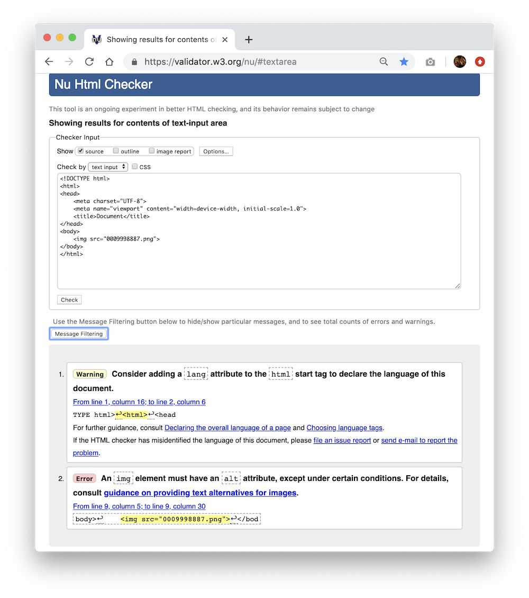
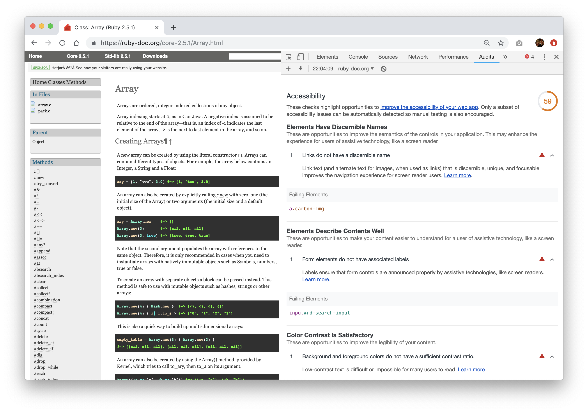

# Accessibility

## What are we learning here?

* Awareness of personal and technological capabilities affecting universal access to online information.
* An introduction to the four principles of the Web Content Accessibility Guidelines (WCAG).
* Making page links operable by keyboard.
* Identifying the document's language.
* Providing alternative text for page media.
* HTML 5 validation
* Awareness of assistive technologies.
* Awareness of user experience using a screen reader.

<br>

# What is *accessibility*?

<br>

> *"The power of the Web is in its universality. Access by everyone regardless of disability is an essential aspect."*<br>
> ~ Tim Berners-Lee, W3C Director and inventor of the World Wide Web

<br>

An accessible product is one that can be used by people with varied personal and technological capabilities. In web development this is called *accessibility*.

<br>

# Web Content Accessibility Guidelines (WCAG)

The [Web Content Accessibility Guidelines (WCAG)](https://www.w3.org/TR/WCAG20/) is the standard for **web accessibility** written primarily for developers to address accessibility concerns for users who...

* have limited visual, hearing, motor or cognitive capabilities
* have limited access to bandwidth & technology
* require language and cultural contextualisation

The four main principles of the WCAG...

1. Perceivable - Information and user interface components must be presentable to users in ways they can perceive.
2. Operable - User interface components and navigation must be operable.
3. Understandable - Information and the operation of user interface must be understandable.
4. Robust - Content must be robust enough that it can be interpreted reliably by a wide variety of user agents, including assistive technologies.

<br>

## Principle 1: Perceivable - Information and user interface components must be presentable to users in ways they can perceive.

There are four guidelines addressed in principle 1. Let's discuss the guideline for providing  **alternative text** for images.

When alternative text is specified in the **image** element, screen readers can read the description of the image. This benefits those with limited hearing capabilities, as well as those who benefit from the use of screen readers for other reasons such as limited reading capabilities or simply for convenience.

````

````

Code snippet 1: *alt="Geochart of Japan shows gender ratio by prefecture"* is added to the image element. This provides a readable description of the image to screen readers and other agents.

<br>

Note, however, the usefulness of alternative text relies upon providing an adequate and meaningful description of the image.

The guidelines provide the following advice...

> *Text alternatives are a primary way for making information accessible because they can be rendered through any sensory modality (for example, visual, auditory or tactile) to match the needs of the user. Providing text alternatives allows the information to be rendered in a variety of ways by a variety of user agents. For example, a person who cannot see a picture can have the text alternative read aloud using synthesized speech. A person who cannot hear an audio file can have the text alternative displayed so that he or she can read it. In the future, text alternatives will also allow information to be more easily translated into sign language or into a simpler form of the same language.*

<br>

## Principle 2: Operable - User interface components and navigation must be operable.

There are four guidelines addressed in principle 2. Let's discuss the guideline for providing  **pages operable by keyboard**.

An [Accessibility Agent](https://www.w3.org/TR/UAAG20-Reference/#intro-def-ua) is a broad term for a software solution which provides assistive technology to users with limited visual, hearing, motor or cognitive capabilities.

The agent can be used to operate a web page using only keyboard input.

The agent identifies links on a page by looking for the **a** element. The links can then be browsed using the **tab** key, read allowed (by the agent) and selected by pressing enter. The part of the link which is read allowed is the *link text*.

Consider the following code snippet...

````
Click to order apples <a href="somepage.html">here</a>.
````
Code snippet 2: Link text is "here".

<br>

When the user operates the page using **tab**, the screen reader will read *"here"*. We can do better than that!

The guidelines provide the following advice...

> *Whenever possible, provide link text that identifies the purpose of the link without needing additional context. Assistive technology has the ability to provide users with a list of links that are on the Web page. Link text that is as meaningful as possible will aid users who want to choose from this list of links. Meaningful link text also helps those who wish to tab from link to link. Meaningful links help users choose which links to follow without requiring complicated strategies to understand the page.*

Consider the next code snippet...

````
<a href="somepage.html">Click to order apples</a>
````
Code snippet 3: Link text is "Click to order apples".

<br>

When the user operates the page using **tab**, the screen reader will read *"Click to order apples"*. Better! By providing meaningful link text, we have made page links which have context and are operable by keyboard.

<br>

## Principle 3: Understandable - Information and the operation of user interface must be understandable.

There are three guidelines addressed in principle 3. Let's discuss the guideline for identifying the  **default human language** of a web page.

When the language of a html document is identified in the **html** element, screen readers and other agents can (more effectively) provide translations to the client's language.

````
<!DOCTYPE html>
<html lang="en">
<head>
    <meta charset="UTF-8">
    <meta name="viewport" content="width=device-width, initial-scale=1.0">
    <title>Document</title>
</head>
<body>
    
</body>
</html>
````
Code snippet 4: *lang="en"* attribute added to html element. This identifies the language of the page content to screen readers and other agents.

The guidelines provide the following advice...

> *Both assistive technologies and conventional user agents can render text more accurately when the language of the Web page is identified. Screen readers can load the correct pronunciation rules. Visual browsers can display characters and scripts correctly. Media players can show captions correctly. As a result, users with disabilities will be better able to understand the content.*

<br>

## Principle 4: Robust - Content must be robust enough that it can be interpreted reliably by a wide variety of user agents, including assistive technologies.

There is one guideline addressed in principle 4. Let's discuss  **HTML 5 validation**.

Browsers and assistive agents must be able to *parse* web page source against the [HTML 5](https://www.w3.org/TR/2014/REC-html5-20141028/) standard. If the source contains errors; such as missing closing tags or incorrectly nested elements, parsing will fail. When parsing fails, the page will either not be rendered at all or will render and be interpreted by agents in an unpredictable fashion. 

The [W3 HTML Checker](https://validator.w3.org/nu/) can validate a URL, file or text. It will produce a report about the conformance of the source against the HTML 5 standard. 

The HTML standard provides for many of the WCAG standards and as such, the errors and warnings generated by the checker can provide quick insight into how you should improve your page. It is also excellent for general troubleshooting of missing tags, etc.

For example, I passed the HTML checker the text from a html page which does not provide a page language or provide alternative text for an image. See the result...



Figure 2: Result of the passing the text from a html page which does not provide a page language or provide alternative text for an image.

<br>

Notice the warnings given and that further advice can be gained by clicking through the links.

<br>

The guidelines provide the following advice...

> *The intent of this Success Criterion is to ensure that user agents, including assistive technologies, can accurately interpret and parse content. If the content cannot be parsed into a data structure, then different user agents may present it differently or be completely unable to parse it.*

<br>

# Who cares about the WCAG?

Actually, many governments have [Web Accessibility Laws & Policies](https://www.w3.org/WAI/policies/) relating to their implementation targets for the WCAG.

For example...

* [Australian Government Digital Standard](https://guides.service.gov.au/digital-service-standard/9-make-it-accessible/)

* [gov.uk Service Manual](https://www.gov.uk/service-manual/helping-people-to-use-your-service/making-your-service-accessible-an-introduction#meeting-government-accessibility-requirements)

Many corporate style guides also make mention of the WCAG, for instance, [ABC Editorial Policy on Accessibility](https://edpols.abc.net.au/guidance/accessibility/)

<br>

# Accessibility audit tools

There are many audit tools to choose from; [W3 HTML Checker](https://validator.w3.org/nu/) was discussed  above. I recommend that you also take a look at...

<br>

## :paperclip: Google Chrome Developer Tools > Audits

Open Chrome's developer tools and navigate to the **audit** tab. Make sure you select the **accessibility** category to run an accessibility audit on any page.

[Chrome Tools for Developers - Accessibility Reference](https://developers.google.com/web/tools/chrome-devtools/accessibility/reference)



Figure 3: Chrome Tools for Developers. Accessibility report for https://ruby-doc.org/core-2.5.1/Array.html

<br>

# The WCAG is so BIG - where do I start?

W3C has published [Tips for Getting Started Writing for Web Accessibility](https://www.w3.org/WAI/tips/writing/)

<br>

# :trophy: Challenge - Validate Me

1. Select a page of your choice.
2. Validate the page using the [W3 HTML Checker](https://validator.w3.org/nu/).
3. Read the report to identify any warnings related to accessibility.
4. Publish a **small** report to github including a description and screenshots of your observations. Include detail on any elements which failed the WCAG guidelines and why.
5. Share your report via slack in the **#design** channel using hashtag **#validatemechallenge**.

<br>

# :trophy: Challenge - Chrome Audit Report

1. Select a web page - I recommend something simple; such as google.com, and run an accessibility report via Chrome's audit developer tools.
2. Publish a **small** report to Github on your observations of the audit report. Include a description of your observations (page name, failure points, etc) and screenshots.
3. Share your report via slack in the **#design** channel using hashtag **#chromeauditreportchallenge**.

<br>

# :trophy: Challenge - Tricky Text

* Here's a little research task for you. Read the following statement...

    *"My site uses images; rather than text, to display content headings."*

1. What is the WCAG advice around this?
2. Create short response to this on Github.
3. Share your response in the **#design** channel on Slack using the hashtag **#trickytext**.

<br>

<hr>

# :trophy: Challenge - Vox

This challenge uses the ChromeVox screen reader plugin for Chrome but you can use any screen reader for this challenge. The point is to experience the web page through the assistance of a screen reader.

1. Install the [ChromeVox](https://chrome.google.com/webstore/detail/chromevox/kgejglhpjiefppelpmljglcjbhoiplfn?hl=en) screen reader for Chrome.
2. Navigate to a mainstream commercial site such as a news portal.
3. Using a rating out of 5, how likely would you be to return to this site if you had to use a screen reader to access the content?
4. Post your answer to the **#design** channel using hashtag **#voxchallenge**.

<br>
<hr>

