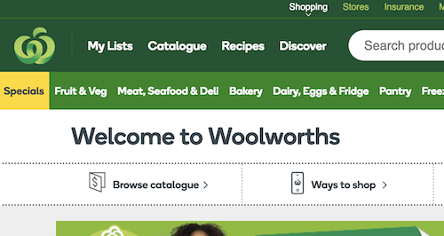
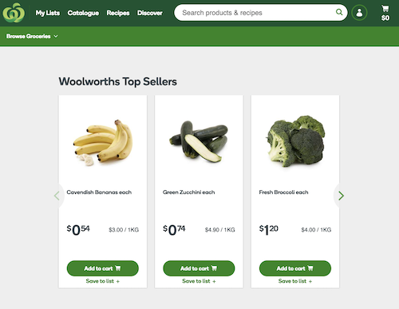
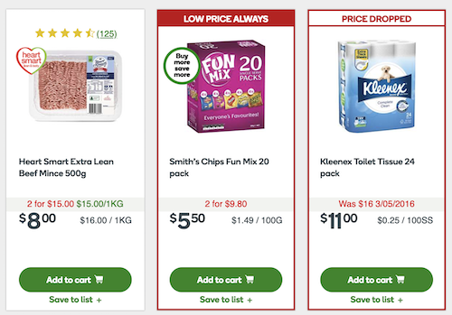
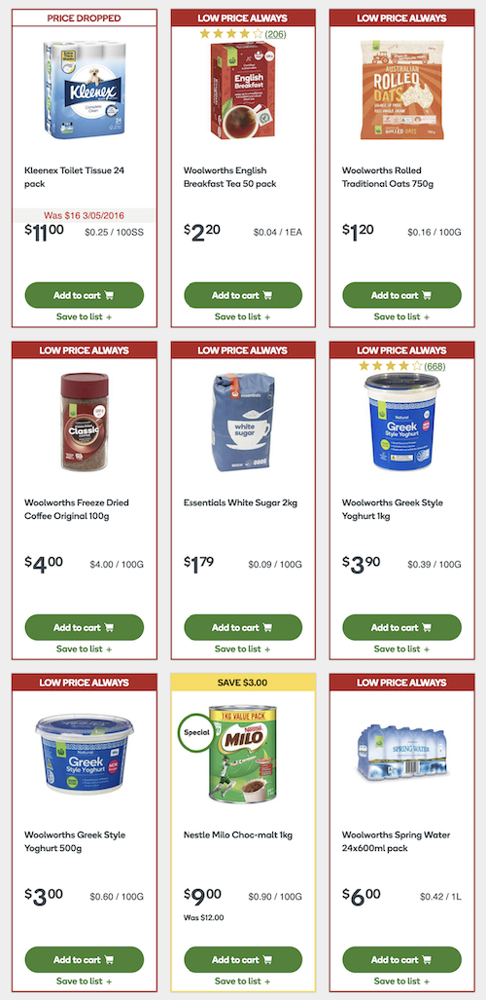
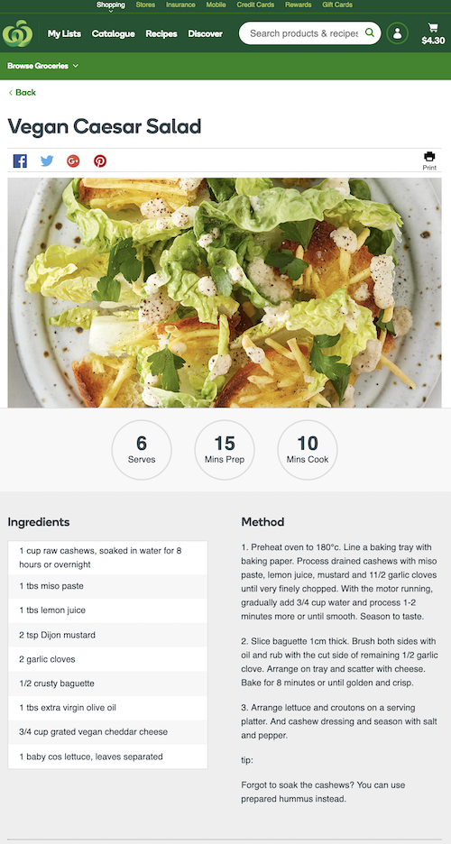
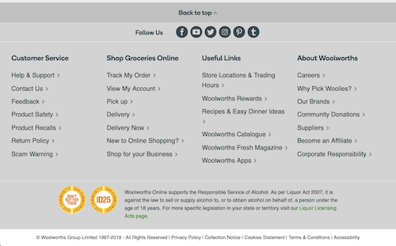
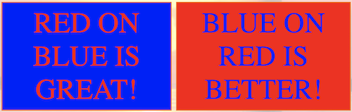
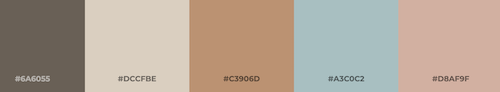

# Color

## What are we learning here?

* Awareness of color as an influencer and indicator.
* Awareness of appropriate color contrast.
* Tools that can help us create product color schemes.
* Develop an appreciation for the good, bad and ugly of color design.

## Recommended viewing

* [The Psychology Behind Colors](https://www.youtube.com/watch?v=8wnGUxVaifs&list=PLutteG3naGHo0InCzDslLMXj2z2gYBUpD&index=17&t=1s)
* [How Jack White Uses Color](https://www.youtube.com/watch?v=EWQukUW5tQc&list=PLutteG3naGHo0InCzDslLMXj2z2gYBUpD&index=19&t=1s)
* [The world's worst website ever!](https://www.theworldsworstwebsiteever.com/)

## Recommended reading

* [Web design color theory: how to create the right emotions with color in web design](https://thenextweb.com/dd/2015/04/07/how-to-create-the-right-emotions-with-color-in-web-design/)

 

# Why do I need to think about color?

If you are designing *any* product then you *must* consider color!

 

# What does color mean?

How are colors perceived? How do they make us feel? If I am promoting a food delivery feature, how might color influence my customer? If my app is primarily for data entry and retrieval, does color even matter?

Consider usage of the color **red**. It, along with **orange**, is typically used in communication design as a caution or warning. :warning: :no_entry_sign: :fire: :collision:

 

# A look at Woolworths

[Woolworths](https://www.woolworths.com.au) online shop. Desktop version viewed at 800x798px. Retrieved May 2019.

Woolies (Woolworths) has a large commercial website which allows users to shop for groceries online. Let's have a quick look at how they use color...

 

## Color Scheme

* complimentary to the brand logo
* green might make us think *vegetables, fresh*

Figure 1: Screen capture fragment of Woolworths online shop.

 

## Whitespace

* use of [whitespace](https://www.interaction-design.org/literature/article/the-power-of-white-space) to bring focus to content

Figure 2: Woolworths Top Sellers content area.

 

## Highlights

* contrasting colors (red and yellow) bring focus to specials and savings in an otherwise *long* list of products

Figure 3: Fragment screen shot of Woolworths online shop product list.

 

Figure 4: Fragment screen shot 2 of Woolworths online shop product list.

 

Note that the *Add to cart* button is *always* green and *always* in the same position.

 

## Lowlights

### Recipes

* Woolies also publishes a *Recipes* section which uses a low contrast color scheme to display the ingredients and method. The image of the complete dish, is the hero.

Figure 5: Vegan Caesar Salad recipe from the recipes section of Woolworths online shop.

 

### Page footer

* the [footer](https://www.orbitmedia.com/blog/website-footer-design-best-practices/) also uses low contrast to display directory information
* side note: the yellow/red badges relate to a self regulatory [ALSA initiative called ID-25](https://www.alsa.com.au/alsacontent/self-regulatory-initiatives). I was unable to find this badge in yellow/red on any other site. It looks like Woolies did not like the standard black badge and have modified it to fit with the site's color scheme?

Figure 6: Woolworths online shop footer.

 

## Consistency

Note that the color scheme has been used consistently throughout the site.

 

# What about color contrast?

Dark text on a light background is a winning combination for large swathes of text. But what about other elements such as callouts and headings?

How do you feel about...

Figure 7: Eye-watering contrasting colors from the [World's Worst Website Ever](https://www.theworldsworstwebsiteever.com/)

 

**Aside from the obvious** crimes of *high-contrast* design, there is also a backlash against the trend toward *low-contrast* design. The **Nielsen Norman Group** (world leaders in user experience research) published [Low-Contrast Text Is Not the Answer](https://www.nngroup.com/articles/low-contrast/), citing designs; such as apple.com, which at the time (2015) was using low-contrast text design. The author considers the usability of low-contrast text and how we might look back on this trend. 

Contrast influences readability and legibility. Light or dark? How to choose? [Light or Dark UI? Tips to Choose a Proper Color Scheme for User Interface](https://uxplanet.org/light-or-dark-ui-tips-to-choose-a-proper-color-scheme-for-user-interface-9a12004bb79e) gives some food for thought.

 

# Tools for deciding on a color scheme

I'll admit it - I'm not a world class designer but I do have a few tools in my kit to help me!

Remember the westmacsapp? My inspiration pic which lead my design thinking during the initial Mood Boarding phase...

Figure 8: westmacsapp inspiration pic.

 

I uploaded this image to [ColorFavs](http://www.colorfavs.com/) and in return was provided with this color scheme...

Figure 9: Color palette generated by ColorFavs.

 

This was a great first step for deciding colors in the layout, however, I will still need a darker color for the headings and main text (we'll see).

 

Other color tools you may like to play with...

* [Adobe Color Wheel](https://color.adobe.com/create/color-wheel/)
* [colorsafe.co](http://colorsafe.co/)

 

# :trophy: Challenge - But what does it mean?

Post your answers to the **#design** channel...

* Colors that promote appetite #appetitecolors
* Colors that promote staying awake #awakecolors
* Colors that promote trust #trustcolors
* Colors that promote distrust #distrustcolors
* Colors that promote danger #dangercolors
* Colors that promote *you* #mycolors

# :trophy: Challenge - Color Mix Boss

1. Identify a site that you think makes appropriate use of color.
* Publish a **small** visual report to Github which includes descriptions, justifications and screenshots of your observations.
* Tell us what you really think - what was done *super* well!
* Share the link via slack in the **#design** channel using hashtag **#colormixbosschallenge**.

# :trophy: Challenge - Color Mix HACK

1. Identify a site that you think does **not** use color appropriately
* Publish a **small** visual report to Github which includes descriptions, justifications and screenshots of your observations.
* Tell us what you really think - what was done *horribly*!
* Share the link via slack in the **#design** channel using hashtag **#colormixhackchallenge**.

 

