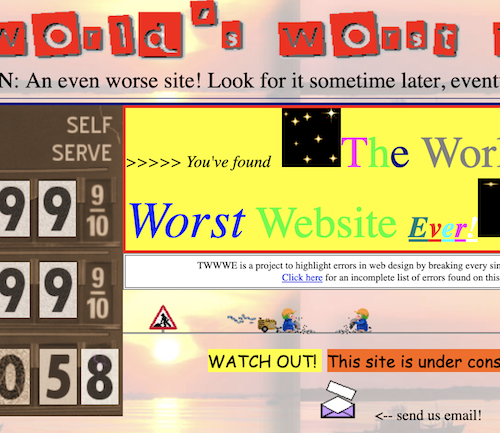
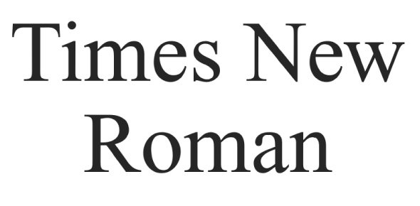
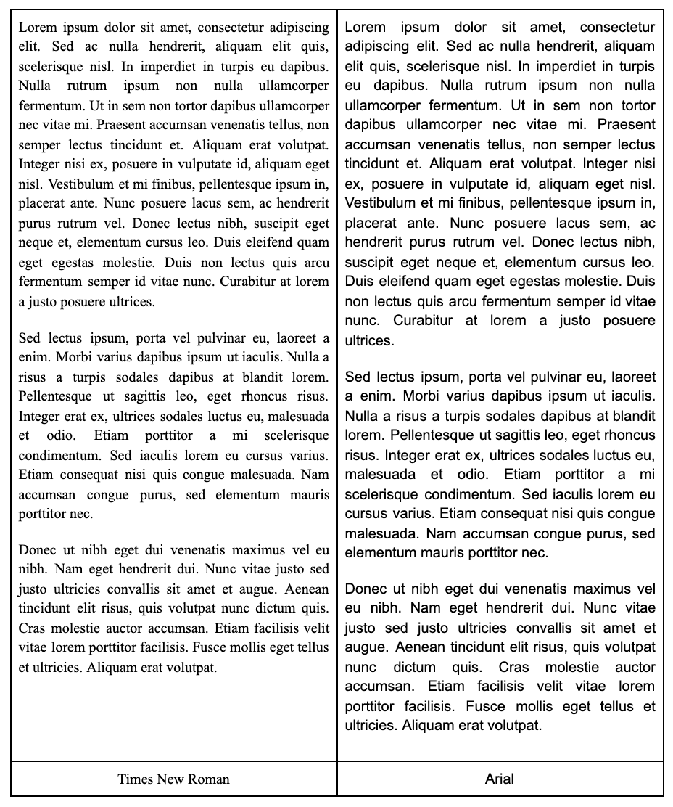
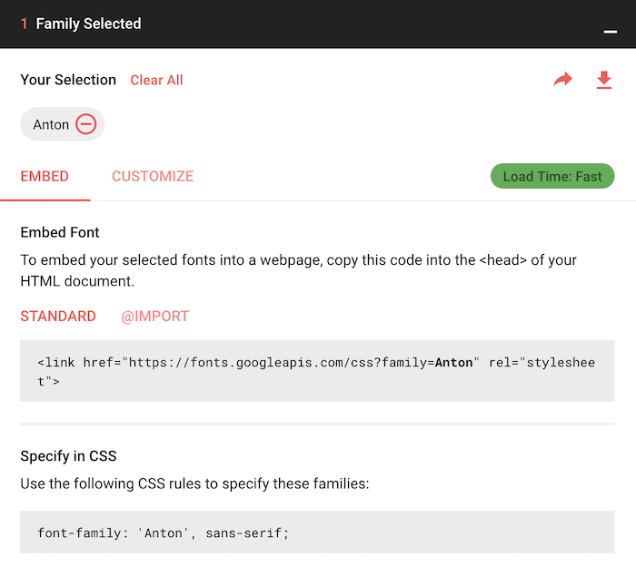

# Fonts

## What are we learning here?

* A brief history of default fonts.
* Resources for font-matching.
* The CSS font-family property.
* Content Delivery Networks (CDN) for fonts.

<br>

Font selection for a project may be determined by organizational style guide specifications or by mood boarding and design mock-ups.

<br>

 :clap: The golden rule of thumb - **do not mix too many fonts!**.

 <br>

Remember [The world's worst website ever](https://www.theworldsworstwebsiteever.com/)?



Figure 1: Screen grab of [The world's worst website ever](https://www.theworldsworstwebsiteever.com/)

<br>

# Screen fonts

Fonts live on the client's machine. When an app specifies that a font named *Crazy Big Time Font* should be applied to an element, the operating system must look for that font on the system. If it can't be found, a default font will be used instead - and **Times New Roman** will *probably* be that default.



Figure 2: Times New Roman text - found everywhere!

<br>

In fact, have you noticed that the default font for pretty much every browser you have ever met is Times New Roman? This has roots in the early 20th century publishing industries. The font has managed to endure and find its way onto just about every digital device (citation needed) in the world!

Whilst Times New Roman was a good choice for paper publishing (for reasons including space optimisation), there are better choices for screen text. 

Take Arial for instance....


Figure 3: Arial - also ubiquitous.

<br>

Arial is also ubiquitous - and uses cleaner lines.

Let's compare them side by side...

<br>



Figure 4: Times New Roman and Arial compared.

<br>

 :information_desk_person: Now it may be a matter of opinion but it is generally acknowledged that fonts with cleaner lines make better screen fonts.

What do you think?

# Putting fonts together

Whilst mixing too many fonts is not recommended, it is reasonable to expect that your project will probably require at least two fonts...

1. Headings
2. Paragraph text

Heading text is likely to have a decorative flavour whereas paragraph text; which may contain thousands of characters at a time, should  be kept clean and simple. But how do you put them together?

Here are some resources for information and inspiration...

* :link: [A Non-Designer's Guide to Pairing Fonts | Visual Learning Center by Visme](https://visme.co/blog/pairing-fonts/)
* :link: [Font Joy](https://fontjoy.com/)
* :link: [Typ.io](http://typ.io/)

<br>

# CSS font-family

As mentioned previously, fonts live on the client's machine. For this reason, we need to be careful to specify fonts that we can reasonably expect to be installed. But what happens if a font is not available?

The [CSS font-family](https://www.w3schools.com/cssref/css_websafe_fonts.asp) property can be used to specify a list of fonts, in order of preference.

For instance...

````
body {
    font-family: Arial, Helvetica, sans-serif;
}
````
Code snippet 1: Specifying the CSS font-family property for the body element.

<br>

By specifying the three fonts in the *font-family* property, we have created a  fallback system should our first or second choice fail.

<br>

# Loading fonts at runtime

Want to use a really trendy font that you can't guarantee is available on the client machine? Consider selecting that trendy font from a content delivery network (CDN) such as [Google Fonts](https://fonts.google.com/).

Google Fonts has a huge directory of free fonts which can be downloaded on the client machine as your page is loading. There's plenty of debate over the use of CDN's (and I am yet to make up my own mind!) with regards to efficiency, however, if you *really* want to use a stunning font, this may be the answer for you.

A link to the font is placed within the head of the document. From there, you can access the font as usual via your CSS file.



<br>

Your turn...

<br>

<hr>

# :trophy: Challenge: Font Family

1. Create linked html and css stylesheet files.
2. Create styles for the h1 and p elements which specify unique font families.
3. Preview the page to see the result.
4. Publish your files to Github.
5. Share on the **#design** Slack channel using the hashtag **#fontfamilychallenge**.

<br>

# :trophy: Challenge: CDN font

1. Select a font from Google Fonts.
2. Create linked html and css stylesheet files.
3. Embed the link to the Google font in the head of the document.
4. Create a style for the body element which specifies the Google Font name.
5. Preview the page to see the result.
6. Publish your files to Github.
7. Share on the **#design** Slack channel using the hashtag **#cdnfontchallenge**.

<br>
<hr>


