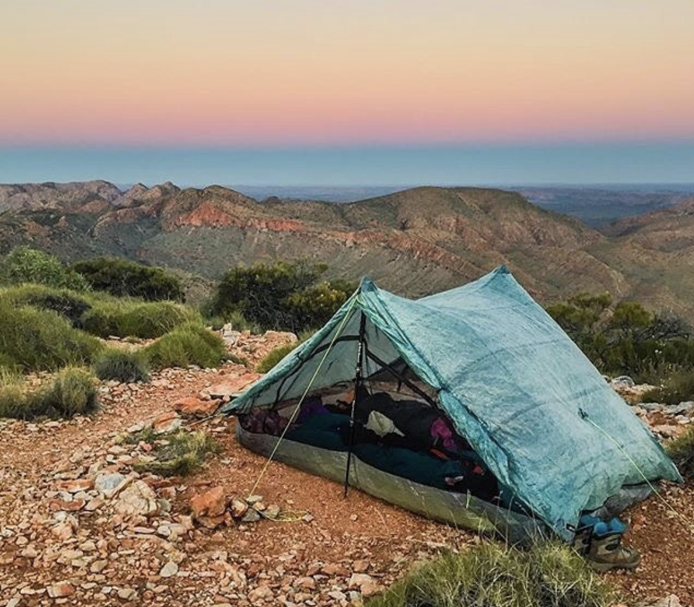
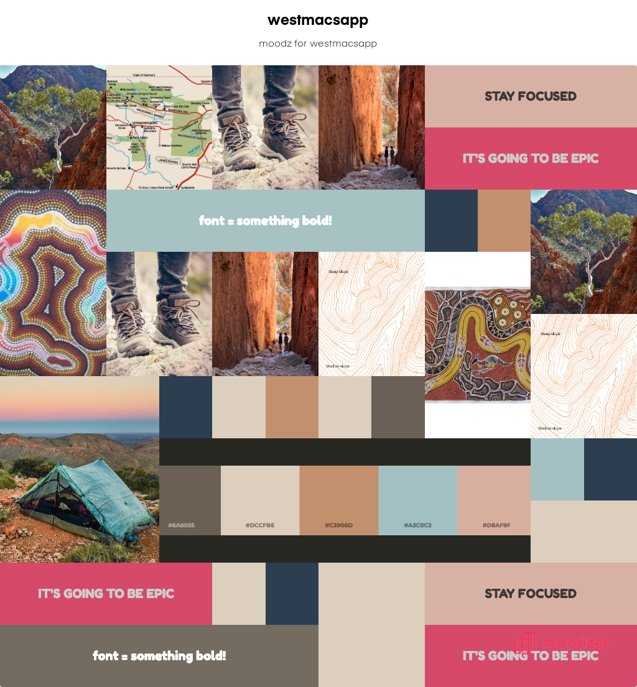
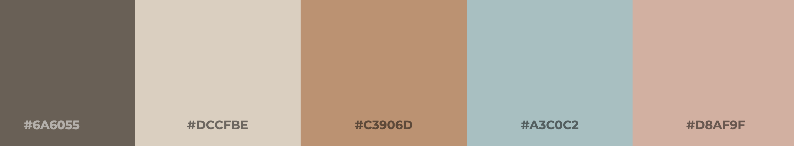

# Mood Board challenge

*The client (me) has produced this image as the inspiration for the look and feel of a new product. This image will be central to our Mood Board.*

## What is a Mood Board?

A **Mood Board** is a design tool which helps you explore the look and feel for a new product. It is a themed collage of images, colors, fonts, words and phrases.

You can create your own Mood Board or work collaboratively as a team or with a client. It's a great way at arriving at a design consensus.

## What a Mood Board is *not*

A Mood Board is **not** a mock-up for a user interface design but it *should* help you to get to that step. 

## My mood board

Let's say I'm creating an app for viewing and documenting hiking field notes for the West Macdonnell Ranges in the Northern Territory of Australia. I want the look and feel to be journal-like, using earthy colors and having some punchy titles.

Here's the first Mood Board I created...

### Mood Board tool
I used [Moodzer](https://moodzer.com) for this Mood Board but you can use any tool which allows you to create a collage. This was my first time using Moodzer but I could just have easily used Google Docs.

Also, real life Mood Boards (spreads, flat-lays) are fun!

### Color palette tool
I also used [ColorFavs](http://www.colorfavs.com/) to generate a palette of colors from my inspo-pic (inspiration-pic).

### Imagery, words & phrases

*Boots, tents, dirt, dust and rugged terrain* all fit the brief. Whilst an image or two from the Mood Board may make it into the final product, what's relevant here is the look and feel I am going for.

** *Stay focused. It's going to be epic* ** is a borrowed phrase which has become a personal motto. This phrase is highly likely to make it into the final product but not neccessarily.

I know I want a heavy font for titles and headings but with so many to choose from, I'll reserve that decision for now.

# Your challenge

Do you have an idea for a killer app? How about an idea of something that would just be fun/pretty/interesting to make?

1. Decide a theme/product.
2. Create a Mood Board for the product.
3. Publish a description of the product and your Mood Board to Github.
4. Share the link via slack in the **design** channel.
