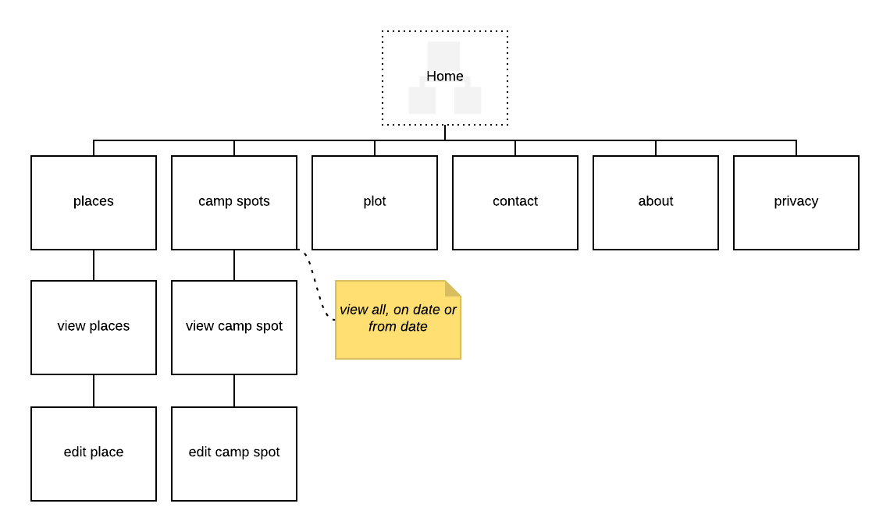

# Sitemaps

## What are we learning here?

* The purpose and structure of a sitemap.
* Tools to create sitemaps.
* Creating a sitemap from a simple specification.

 

# What is a sitemap?

A **sitemap** is a simple tree diagram which shows *all* screens/pages within an app.

* Number and name of pages.
* Navigability between pages.

 

*Remember the westmacsapp...*

Figure 1: Sitemap for the westmacsapp.

The site map shows that there are six main sections which can be navigated to from the home page. The *camp spots* page provides navigation to the *view camp spots* page, which in turn provides navigation to the *edit camp spots* page.

You can also include notes on the sitemap where it makes sense to do so but remember not to clutter up the illustration.

 

# *Why* create a sitemap?

* :+1: It's a planning tool!
* :+1: Sitemaps can be shared with your team and your clients during planning.
* :+1: Sitemaps can form part of the final project brief, promoting consensus, agreement and assist with acceptance testing.

 

# Sitemap tools

Sitemaps are very easy to create using any software solution which can draw lines and rectangles. The sitemap diagram in this discussion was created using [Lucid Chart](http://www.lucidchart.com).

 

*Now it's your turn...*

 

# :trophy: Challenge: The Banker

1. Create a sitemap for your internet banking app.
* Start by sketching out the names of pages/screens and the navigability between them.
* Create the sitemap.
* Publish your sitemap and a description (app name, etc) to Github.
* Share the link via slack in the **#design** channel using hashtag **#thebankerchallenge**.

 

