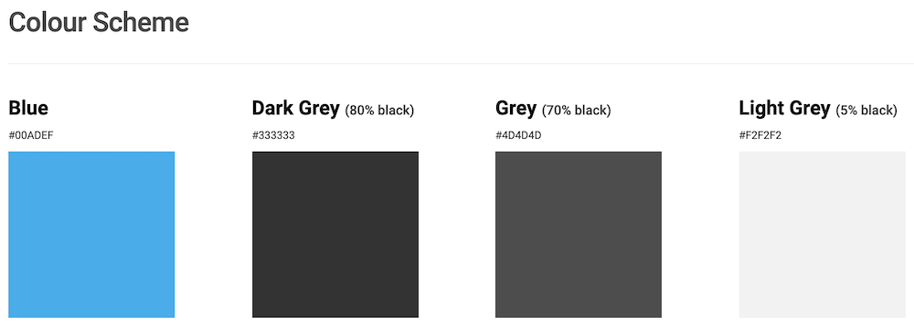
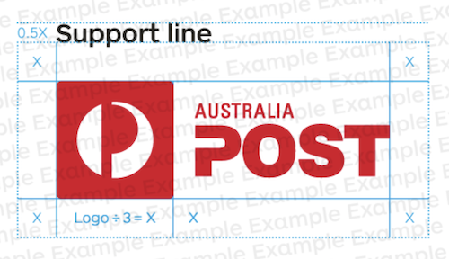

# Style Guides

## What are we learning here?

* Purpose of a style guide.
* Style guides found within organisations.
* Typical format and contents of a style guide.
* Creation of a simple style guide from an example product.

# What is a style guide?

A **Style guide** is an organisational document which specifies the stylistic rules and conventions which should be followed when publishing information and documents.

This includes...

* Use and placement of logos and branding
* Font selection
* Words, phrases and grammar

Imagine a large organisation (or even a small one). A style *guide* helps everyone to maintain   consistent branding, look and feel for all all products (web, print, etc).

When negotiating a new design project, one of your questions should be *"Does your organisation have a style guide?"*. If there is no *official* style guide then that's your chance to **value add**. 

 

# Why use a style guide in a project?

Often times you will be *required* to follow an organisational style guide, however, for a new product or business, a style guide is...

* :+1: It's a design tool!
* :+1: Style guides can be shared with your team and your clients during planning.
* :+1: Style guides can form part of the final project brief, promoting consensus, agreement and assist with acceptance testing.

 

# What does a style guide look like?

As you will see in the discussion below, style guides can be varied in their presentation and content. At a minimum, a text document created using a standard word processor is appropriate for the task.

 

# United Nations Web Style Guide

The [United Nations Web Style Guide](https://www.un.org/styleguide/) includes not only the style guide but also many justifications for their choices.

For instance, the guide specifies the *Roboto* font and then goes on to state..

*"Roboto has a dual nature. It has a mechanical skeleton and the forms are largely geometric. At the same time, the font features friendly and open curves. While some grotesks distort their letterforms to force a rigid rhythm, Roboto doesn’t compromise, allowing letters to be settled into their natural width. This makes for a more natural reading rhythm more commonly found in humanist and serif types."*

The **Color Scheme** guide gives prescriptive advice regarding when and where color may be used, for instance...

:point_right: *"Blue is used for page elements but NOT for text nor backgrounds."*

Figure 1: Screen shot [United Nations Web Style Guide](https://www.un.org/styleguide/) - color scheme.

 

# Australian Government's Digital Transformation Agency

The **Australian Government's Digital Transformation Agency** provides extensive advice on how [Australian Government branding](https://www.dta.gov.au/help-and-advice/guides-and-tools/requirements-australian-government-websites/branding) should be applied. This includes...

* how multiple agencies should *stack* their branding
* alternative text for images
* how to correctly refer to the Australian Governement 
* placement of branding on non-government sites

One particular **Agency website** guideline states:

:point_right: *The Agency design should appear at the top left of every page of an agency website. The design can be used to link to the agency’s homepage.*

 

# Customer use of the Australia Post brand

**Australia Post** provides specific advice regarding [customer use of the Australia Post brand](https://auspostbrand.com.au/customer-logo/terms-and-conditions.aspx) on packaging.

Note that specific dimensions are quoted for the amount of [whitespace](https://blog.prototypr.io/importance-of-white-space-in-design-5a40c0e65bfd) which should be provided around logos.

Figure 2: [customer use of the Australia Post brand](https://auspostbrand.com.au/customer-logo/terms-and-conditions.aspx) - white space around logo.

 

# The ABC Style Guide for grammar, style and usage

The **Australian Broadcasting Corporation (ABC)** provides the [The ABC Style](https://about.abc.net.au/abc-editorial/the-abc-style-guide/#Capitals) which provides extensive advice on grammar, style and usage.

:joy: Fun points of interest (under **K**):
* Refer to **KFC** *not* Kentucky Fried Chicken.
* kung fu should be spelled with no caps.
* Game of Thrones - *If you get this wrong (e.g. Games of Thrones) you need to brush up on your popular culture.*

 

Your turn now...

# :trophy: Challenge - Super Stylin

* Visit [Brief History of the Internet](https://www.internetsociety.org/internet/history-internet/brief-history-internet/).
* Make a list of the main page elements.
* Organise this list into a simple style guide. Each element should include...
    * name (eg. *Paragraph text*)
    * attributes included in the style (eg. *text color, font-family*)
    * values for attributes are not required - unless you are super keen!
* Publish your style guide to Github.
* Share the link via slack in the **#design** channel using hashtag **#superstylinchallenge**.

 

