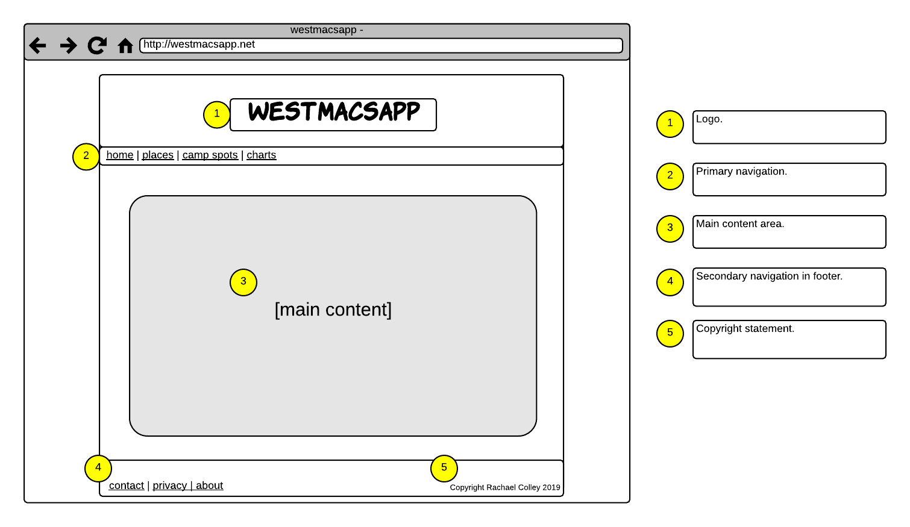
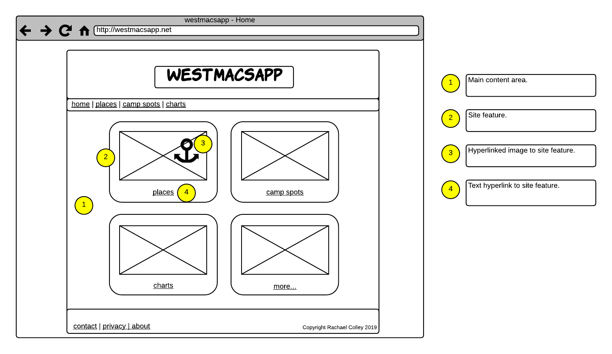
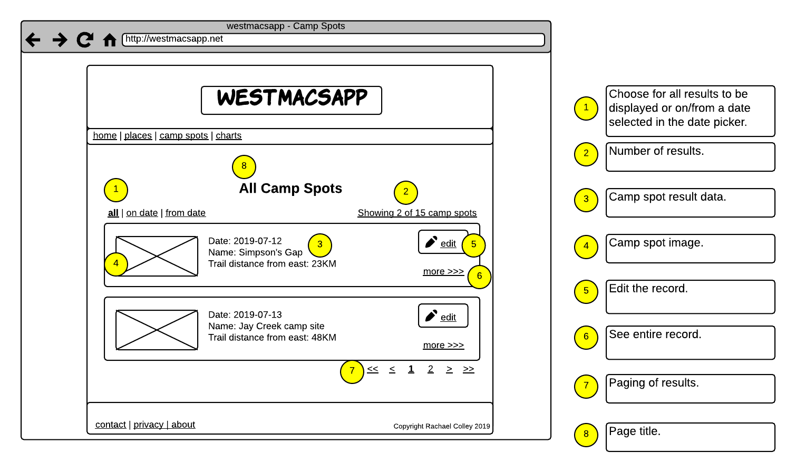
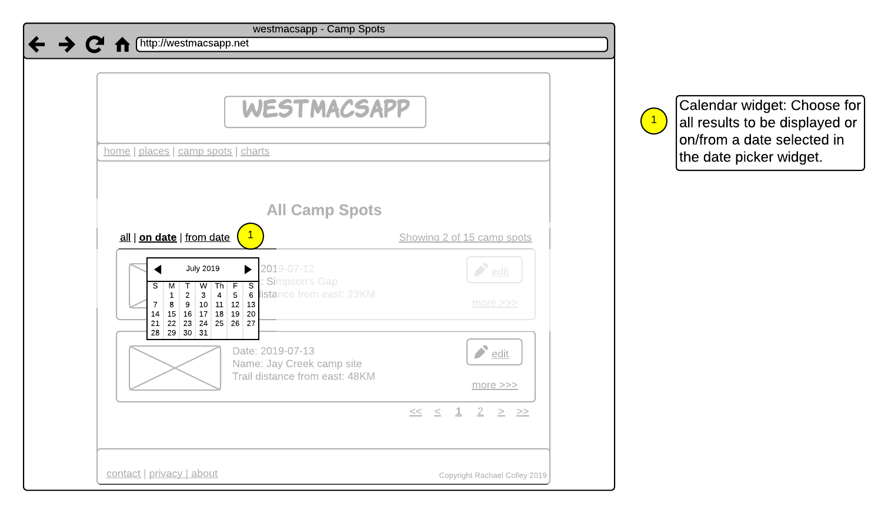
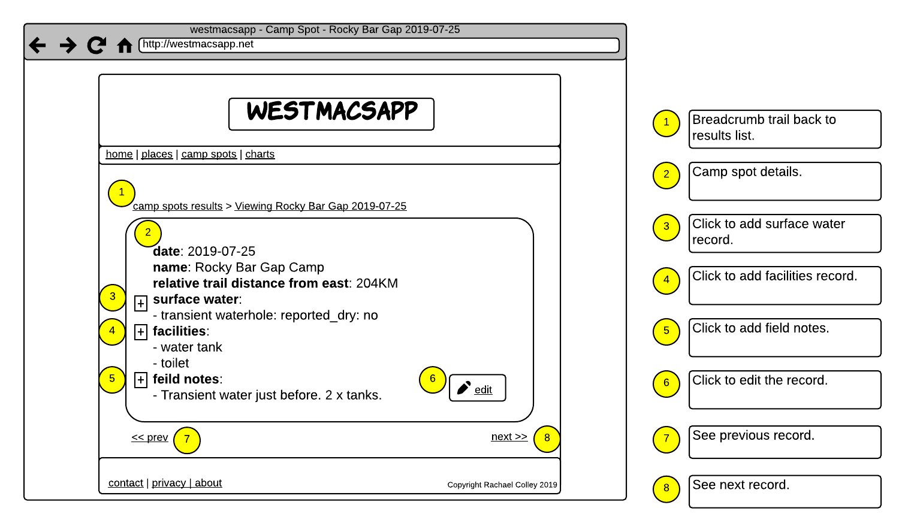
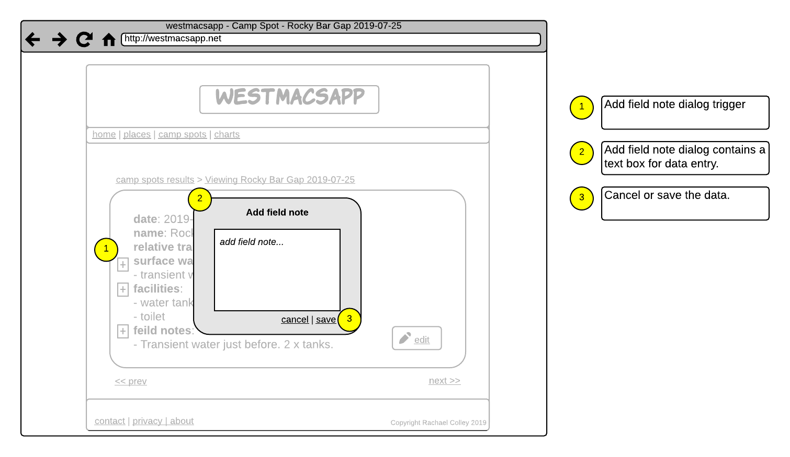
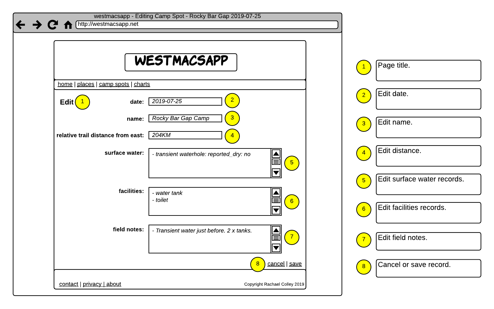

# Wireframes Challenge

## What are we learning here?

* Purpose and content of wireframes.
* How to illustrate design brief features using wireframes.
* Tools for creating wireframes.
* Creating and sharing a wireframe from a simple design specification.

A wireframe is a skeleton for an interface's features. Typically it does not include any style such as colors, logos and images.

# *What* are you *wireframing*?

You are working from a brief (your own, your team's, your client's), and the features within it.

# *Why* wireframe?

* :+1: It's a design tool!
* :+1: Wireframes can be shared with your team and your clients during planning.
* :+1: Wireframes can form part of the final project brief, promoting consensus, agreement and assist with acceptance testing.

# Wireframing tools

So many tools are available. The wireframes in this discussion were created using [Lucid Chart](http://www.lucidchart.com) but others include...

* [Wirify](https://www.wirify.com)
* [Pencil](https://pencil.evolus.vn/Downloads.html)

There's nothing to stop you from using good old paper and pencil but you will probably find that using a software solution is neater and more efficient!

 

Let's return to the *westmacsapp*...

 

# westmacsaapp features (for starters)

## All screens - figure 1
* The logo should be prominently displayed at the top.
* primary navigation to the main content sections - home, places, camp spots, plot.
* secondary navigation to contact, about and privacy policy.
* A copyright statement with the current year.

Figure 1: Template for westmacsapp wireframe.

**Wireframe annotations**

The wireframe is annotated to clearly show how and where each feature is displayed.

Note that only the *skeleton* is shown. Fonts, colors and images are *not* the focus of a wireframe.

 

## Main/home screen - figure 2

* The main screen content should promote the main content sections - places, camp spots and plot.

Figure 2: Home screen wireframe.

 

## View all camp spots - figure 3
* The screen should have a prominent title.
* A preview of each camp spot, containing date, place and distance from Alice Springs (at a minimum) should be displayed in a paged list.
* When the preview is clicked, the full details for the camp spot should be displayed on a new page.
* The preview should contain a direct link to edit the camp spot record.
* The number of results (of all camp spots) should be displayed, as well as the range of the current set of results - for instance *showing 10 out of 15 results*.
* The number of result pages should be available and navigable.

Figure 3: View all camp spots wirefame.

 

## View camp spots by/from date - figure 4

* The camp spot result list can be displayed *for* a particular date, or *from* a particular date.

Figure 4: View camp spots by/from date wireframe.

I've chosen to illustrate this feature in a wireframe of its own so that it does not *clutter* the view of the other features. 

* **Remember** - a diagram of any type is only useful as a communication tool whilst it is simple to read.**

 

## View camp spot - figure 5

* The details for a camp spot should display the following:

    - camp date
    - camp spot name
    - relative trail distance from the east
    - surface water records
    - facilities records
    - field notes records

* surface water, facilities and field notes records should include a link to allow a new record to be added.

* The details for the camp spot should contain a direct link to edit the camp spot record.

* A breadcrumb trail should provide a link back to the result list.

* Navigation should be provided to the previous and next records in the sequence.

Figure 5: View camp spot details wireframe.

 

## Add field note - figure 6

* A text input dialog allows a new surface water, facilities or field notes record to be added.

Figure 6: Add field note to camp spot wireframe.

Again, I have placed this feature in its own wireframe to improve readability.

 

## Edit camp spot - figure 7

* All camp spots should be editable.

Figure 6: Edit camp spot wireframe.

 

## How many wireframes should I create?

Whilst I have chosen only a handful of screens and features for this discussion, typically  you will create at least one wireframe per screen.

Now it's your turn...

## :trophy: Challenge 1: Social Media Maven

You are the next big thing in social media. Create annotated wireframes for the following features...

1. Create a template wireframe containing all standard screen elements:
* Screen title
* navigation (containing standard links and anything else you think of)
* content area
* footer

2. Create a minimum of three wireframes to illustrate the following features:
* View friend status updates.
* Add a *like* to a friend's status update.
* Add a comment to a friend's status update.

3. Share
* Publish your wireframes and a description of each to Github.
* Share the link via slack in the **#design** channel using hashtag **#socialmediamavenchallenge**.

 

## :trophy: Challenge 2: In the Mainstream

1. Create a wireframe for the landing screen of a commercial app of your choice.
* Publish your wireframe and a description (app name, address, etc) to Github.
* Share the link via slack in the **#design** channel using hashtag **#inthemainstreamchallenge**.

 

